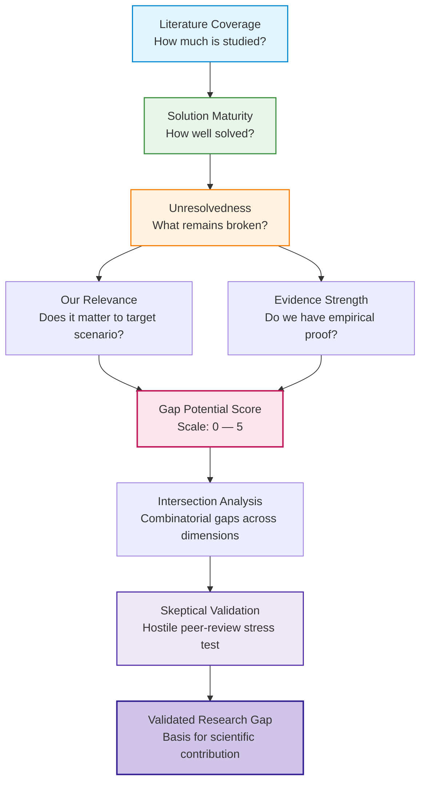
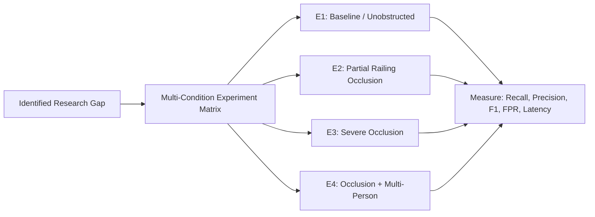
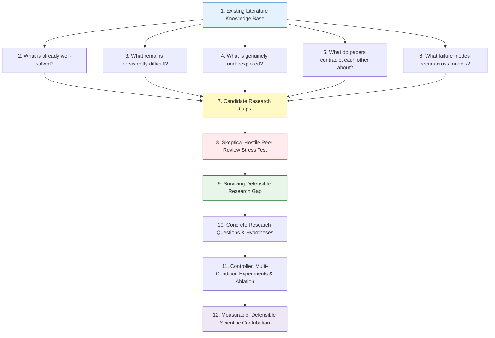

# Empirical Research Roadmap: Evidence-Driven Literature Analysis

> **Cardinal Rule**  
> **NEVER INVENT A RESEARCH GAP.** A gap must emerge strictly from evidence, rigorous cross-paper comparison, and critical empirical analysis of the literature. Never allow Level 0–1 evidence to independently establish a research gap.

---

## 1. Research Landscape Architecture



---

## 2. Research Evidence Hierarchy

Every claim, limitation, or proposed gap must be explicitly calibrated against this 6-level hierarchy:

| Level | Evidence Category | Definition & Verification Standard | Gap Justification Power |
|:---:|:---|:---|:---|
| **Level 5** | **Multi-Study Empirical Proof** | Multiple independent studies with realistic datasets, rigorous cross-validation, and consistent findings. | **Definitive** |
| **Level 4** | **Multi-Study Lab Evaluation** | Multiple quantitative studies, but conducted under constrained or simulated laboratory conditions. | **Strong** (for lab benchmarks) |
| **Level 3** | **Single Strong Study** | Single high-rigor experimental evaluation or multiple smaller/weaker studies with partial validation. | **Moderate** (requires replication) |
| **Level 2** | **Author Claims & Hypotheses** | Author claims in discussion, stated limitations, or suggested future work without quantitative proof. | **Weak** (unverified hypothesis) |
| **Level 1** | **Methodological Inference** | Inferred weakness deduced from architectural limitations or missing baseline tests. | **Insufficient** (must be tested) |
| **Level 0** | **Speculation / Intuition** | Subjective assumptions, unsubstantiated author beliefs, or marketing buzzwords. | **Disqualified** (zero weight) |

> [!CAUTION]
> **Disqualification Rule**: Any candidate gap relying solely on Level 0 or Level 1 evidence is immediately discarded or flagged for experimental verification before acceptance.

---

## 3. Claim-Evidence Audit Protocol

For every major contribution or capability claimed in a research paper:

1. **Record Author Claim**: State the explicit claim in quotations with citation and page number.
2. **Locate Experimental Evidence**: Identify the specific table, figure, or ablation study that tests the claim.
3. **Audit Verification Status**: Assign one of the five audit statuses:
   - `SUPPORTED`: Rigorously proven with reproducible experimental data and valid controls.
   - `PARTIALLY SUPPORTED`: Demonstrated only under restricted conditions; generalizability unverified.
   - `WEAKLY SUPPORTED`: Anecdotal proof, tiny test sample, or biased test conditions.
   - `NOT DEMONSTRATED`: Claimed in the text/abstract but entirely absent from the experimental results.
   - `CONTRADICTED`: Authors' own results or subsequent independent literature contradict the claim.
4. **Identify Boundary Conditions**: Under what exact physical and algorithmic conditions does the claim hold?
5. **Identify Non-Established Aspects**: What did the experiment fail to establish (e.g., lighting, angle, distance)?
6. **Assign Evidence Strength**: Calibrate to Evidence Hierarchy (Levels 0–5).

---

## 4. Cross-Paper Comparability Matrix

Comparing raw accuracy figures across different papers is scientifically invalid unless baseline conditions are normalized. Every comparative analysis must evaluate these 8 dimensions:

```
┌──────────────────────────────────────────────────────────────────┐
│                    COMPARABILITY DIMENSIONS                      │
├──────────────────────────────────────────────────────────────────┤
│ 1. Dataset Consistency     : Same public dataset vs. custom set  │
│ 2. Fall Definition         : Impact only vs. post-fall inactivity│
│ 3. Class Distribution      : Balanced vs. highly skewed (realism)│
│ 4. Train / Test Protocol   : Cross-subject vs. random split      │
│ 5. Subject Demographics    : Healthy youth vs. real elderly      │
│ 6. Environment & Angles    : Controlled lab vs. CCTV staircases  │
│ 7. Sensor & Camera Setup   : High-res RGB vs. low-res CCTV stream│
│ 8. Evaluation Metrics      : Accuracy vs. Precision/Recall/F1/FPR│
└──────────────────────────────────────────────────────────────────┘
```

### Literature Contradiction Analysis
When two reputable papers report diametrically opposed conclusions, document the contradiction explicitly:
- *Example Conflict*:
  - **Paper A**: Claims 2D/3D pose estimation significantly improves detection accuracy and robustness.
  - **Paper B**: Reports that pose estimation degrades under heavy motion blur and provides minimal gain over raw bounding boxes.
  - **Paper C**: Demonstrates that temporal bounding-box aspect ratios outperform skeleton representations under computational constraints.
- *Resolution Protocol*: Isolate whether the discrepancy stems from camera resolution, occlusion levels, frame rate, or model architectures.

---

## 5. Failure Scenario Mining

Standard research benchmarks predominantly evaluate clean, artificial transitions:
$$\text{Standing} \longrightarrow \text{Falling} \longrightarrow \text{Lying Down}$$

Real-world deployment in staircase environments encounters severe edge cases that cause catastrophic false alarms or misses:

| Real-World Scenario | Evaluated in Literature | Common Failure Mode | Project Impact |
|:---|:---:|:---|:---:|
| **Sitting on stairs** | Infrequent | Confused with fallen post-impact state | **Critical** (High FP) |
| **Walking down stairs** | Rare | Downward vertical velocity misclassified as fall | **Critical** (High FP) |
| **Occlusion by railing** | Extremely rare | Skeleton keypoints lost; bounding box truncated | **Critical** (High FN) |
| **Night / Low-light CCTV** | Rare | Feature loss, heavy sensor noise, motion blur | **High** (High FN/FP) |
| **Two people crossing** | Infrequent | Identity swap, bounding box merge, false fall | **High** (Tracking Loss) |
| **Person already lying on floor** | Rare | Detector misses dynamic transition entirely | **High** (Missed Event) |
| **Stumble & recover** | Infrequent | Rapid posture shift triggers premature alarm | **Critical** (High FP) |
| **Carrying bulky objects** | Rare | Keypoint distortion; bounding box deformation | **Medium** (False Alert) |
| **Slow collapse / Slumping** | Extremely rare | Low velocity fails threshold-based detectors | **High** (High FN) |
| **Fall outside camera center** | Rare | Perspective distortion near lens margins | **Medium** (Degraded Acc) |

---

## 6. Gap-Type Taxonomy

Never conflate engineering integration with scientific discovery. Every potential research gap must be categorized under one of the following eight types:

1. **Scientific Gap**: Fundamental theoretical knowledge is lacking (e.g., biomechanical dynamics of staircase falls vs. level-ground falls).
2. **Methodological Gap**: Existing algorithmic pipelines contain mathematical or structural flaws (e.g., inability of single-frame pose to handle non-rigid motion blur).
3. **Dataset Gap**: Available training/benchmark datasets fail to reflect target conditions (e.g., lack of elderly staircase fall video datasets).
4. **Evaluation Gap**: Published methods are tested only on simplistic metrics or unchallenging datasets (e.g., 99% accuracy on simulated falls, zero testing on stairs).
5. **Generalization Gap**: Models perform adequately in the training camera view but fail catastrophically when transferred to new viewpoints or environments.
6. **Deployment Gap**: Models achieve high accuracy but require server-grade GPUs ($>200\text{W}$), making edge CCTV execution infeasible.
7. **System Gap**: Detection algorithms exist in isolation, with no end-to-end integration into emergency response, acknowledgement, or escalation.
8. **Integration Gap**: Combining off-the-shelf YOLO with off-the-shelf Twilio. *Note: This is an engineering task, not a scientific research gap.*

---

## 7. Neutral System Test & Minimum Novelty Criteria

### The Neutral System Test
Before claiming a novel contribution, strip all system branding, promotional terminology, and project names:
> *"If we remove our branding and describe our proposed system neutrally, what scientific or methodological advance remains that has never been documented in the literature?"*

### Minimum Novel Contribution Test
If an existing system achieves $95\%$ accuracy on a standard dataset, and our proposed model achieves $96\%$, **that alone does NOT constitute a scientific research gap or contribution.**

To establish a defensible research contribution, the system must demonstrate validated superiority across at least one of these high-value dimensions:
1. **Dramatically Lower False-Positive Rate (FPR)** on realistic negative activities (walking downstairs, kneeling, sitting).
2. **Zero-Shot Cross-Environment Generalization** to unseen staircase architectures without retraining.
3. **Staircase-Specific Occlusion Robustness** (maintaining detection through handrails and banisters).
4. **Sub-100ms Inference Latency on Edge Hardware** (e.g., embedded Jetson / CPU-only laptop) with negligible accuracy degradation.
5. **Multi-Stage Temporal Verification** that separates stumble-recovery from true unrecoverable impacts.

---

## 8. Automated Experiment Generator

Every identified research gap must be converted directly into an empirical test matrix:



### Experiment Design Template
- **Target Gap**: Inability of vision-based detectors to differentiate sitting on stairs from falling.
- **Experimental Conditions**:
  - `Condition 1`: True fall on stairs (slip/trip downward).
  - `Condition 2`: Normal staircase descent.
  - `Condition 3`: Sitting down intentionally on staircase steps.
  - `Condition 4`: Kneeling/bending down to pick up an object on stairs.
  - `Condition 5`: Stumble with rapid postural recovery.
- **Evaluation**: Complete confusion matrix, time-to-detection, and false-alarm frequency per monitoring hour.

---

## 9. Component Ablation Map

To prevent stacking AI components without scientific accountability ("stacking AI Lego bricks"), every proposed system architecture must be subjected to incremental ablation:

```
[Baseline 1: Detection Only (Bounding Box Velocity)]
         │
         ▼
[Baseline 2: Detection + Multi-Object Tracking (DeepSORT / ByteTrack)]
         │
         ▼
[Baseline 3: Detection + Tracking + 2D Pose Estimation (Keypoints)]
         │
         ▼
[Baseline 4: Detection + Tracking + Spatio-Temporal Model (GCN / Transformer / LSTM)]
         │
         ▼
[Baseline 5: Full System + Post-Impact Inactivity Verification + Escalation Logic]
```

**Key Empirical Question**: Exactly how much does each added layer improve the F1-score and false-positive rate, and does the performance gain justify the latency cost?

---

## 10. Research Question Formulation & Prioritization

Research questions must compete against one another and be prioritized mathematically:

$$\text{Priority Score} = \text{Novelty} \times \text{Importance} \times \text{Feasibility} \times \text{Testability}$$

| ID | Candidate Research Question | Novelty (1–5) | Importance (1–5) | Feasibility (1–5) | Testability (1–5) | Priority |
|:---|:---|:---:|:---:|:---:|:---:|:---:|
| **RQ1** | Can multi-stage temporal verification distinguish staircase stumbling and sitting from actual falls in low-cost CCTV streams? | 4 | 5 | 5 | 5 | **500** |
| **RQ2** | To what degree does banister railing occlusion degrade skeleton-based vs. bounding-box temporal representations in staircase environments? | 5 | 5 | 4 | 4 | **400** |
| **RQ3** | Can an edge-optimized neural architecture maintain real-time ($>15\text{ FPS}$) inference on embedded hardware while preserving low false-alarm rates? | 3 | 4 | 5 | 5 | **300** |
| **RQ4** | How does multi-person occlusion in confined common areas affect temporal tracking identity consistency during a fall event? | 4 | 4 | 4 | 3 | **192** |

---

## 11. Living Research Decision Log

Every architectural and methodological decision must be recorded with empirical justification:

```markdown
### Research Decision Log Template

- **Decision ID**: DEC-001
- **Architectural Decision**: Adopt temporal post-impact verification window (3.0 seconds).
- **Core Motivation**: Prevent single-frame impact misclassifications caused by rapid descent or sitting.
- **Supporting Literature**: Paper 03 (Table 4), Paper 12 (Section III-B).
- **Contradicting Literature**: Paper 07 (claims 1.0s window is sufficient for level ground).
- **Justification for Divergence**: Staircase falls involve prolonged sliding or secondary impacts not present on level ground.
- **Confidence Level**: High (Level 4 evidence).
- **Date**: 2026-09-13
```

---

## 12. Unknowns Register

An explicit record of critical empirical questions that the literature leaves unanswered:

| Empirical Unknown | Root Cause in Literature | Empirical Resolution Strategy |
|:---|:---|:---|
| **Impact of railing geometry on keypoint estimation** | Benchmark datasets record unobstructed rooms | Record controlled staircase sequences with diverse railing pitches |
| **Biomechanical trajectory of true elderly falls** | Ethical constraints prevent realistic elderly experiments | Compare synthetic physics-based models with real-world fall registries |
| **Optimal temporal window for staircase verification** | Literature uses disparate windows ($0.5\text{s}$ to $5.0\text{s}$) | Run parametric window sweep ($0.5\text{s}$–$6.0\text{s}$ at $0.5\text{s}$ intervals) |
| **Low-light CCTV infrared noise on motion features** | Most studies use daylight RGB cameras | Evaluate performance across daylight, dim incandescent, and 850nm IR |

---

## 13. End-to-End Research Synthesis Map



---

## 14. The 7 Core Advanced Modules

To execute this roadmap, the research agent utilizes seven specialized analysis modules:

1. **Claim-Evidence Audit**: Audits every author claim against experimental proof.
2. **Comparability Analysis**: Normalizes datasets, metrics, and protocols before comparing performance.
3. **Contradiction Detector**: Flags and investigates conflicts across independent papers.
4. **Failure Scenario Mining**: Catalogues unaddressed physical failure modes in staircase environments.
5. **Gap-Type Classification**: Disentangles scientific/methodological gaps from engineering integration.
6. **Novelty Collision Detection**: Matches proposed ideas against the closest existing published systems.
7. **Experiment Generator**: Converts confirmed gaps into multi-condition test matrices and ablation suites.
